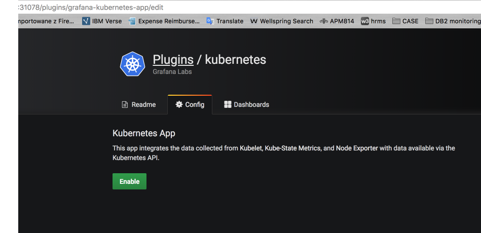

# How to install [grafana-kubernetes-app](https://github.com/grafana/kubernetes-app) in IBM Cloud Private

Outline of configuration steps:

- Configure PersistentVolume to store Grafana configuration.
- Deploy Grafana 5 in ICP using helm chart for Grafana, provided by the Kubernetes project.
- Modify the Grafana Pod with additional container which provide access to cluster API via `kubectl proxy` client. 
- Install the [grafana-kubernetes-app](https://github.com/grafana/kubernetes-app) inside Grafana container.
- Configure connection to cluster API via sidecar container.
- Configure connection to standard ICP Prometheus instance.
- Make minor modifications to Prometheus queries in some of dashboard panels (some labels are specific to ICP).

**Prerequisites:**

- [IBM Cloud Private CLI](https://www.ibm.com/support/knowledgecenter/SSBS6K_2.1.0.2/manage_cluster/install_cli.html)
- [Helm CLI](https://www.ibm.com/support/knowledgecenter/SSBS6K_2.1.0.2/app_center/create_helm_cli.html)

**Procedure:**

1). Add `https://kubernetes-charts.storage.googleapis.com` to the list of helm repositories in ICP.

```
helm repo add kubernetes-charts https://kubernetes-charts.storage.googleapis.com
```

2). Verify that new repository is visible in helm CLI client:

```
$ helm repo update
Hang tight while we grab the latest from your chart repositories...
...Skip local chart repository
...Successfully got an update from the "stable" chart repository
Update Complete. ⎈ Happy Helming!⎈

$ helm repo list
NAME  	URL
kubernetes-charts	https://kubernetes-charts.storage.googleapis.com
local 	http://127.0.0.1:8879/charts
```
3). Configure PersistentVolume where Grafana configuration will be stored.

a. Create file pv-grafana.yaml

```
apiVersion: v1
kind: PersistentVolume
metadata:
  name: g5-grafana
spec:
  accessModes:
  - ReadWriteOnce
  capacity:
    storage: 1Gi
  hostPath:
    path: /tmp/grafana-data
    type: ""
  persistentVolumeReclaimPolicy: Recycle
```

b. create PersistentVolume g5-grafana using command:

```
kubectl create -f pv-grafana.yml
```

4). Install latest version of Grafana (5.0.4 at the time of writing this procedure).

```
helm install --name g5 kubernetes-charts/grafana --set server.service.type=NodePort --tls
```
5). Verify you can logon to new Grafana instance. 

a.Identify port assigned by NodePort using:

```
$ kubectl get services
(...)
g5-grafana                    NodePort    10.0.0.209   <none>        80:3nnnn/TCP   5d 
```
b. Collect initial admin password for your new Grafana 5 installation using:

```
kubectl get secret --namespace default g5-grafana -o jsonpath="{.data.grafana-admin-password}" | base64 --decode ; echo
```
c. Logon to Grafana `http://<ICP_cluster_ip>:<port>`
where `<port>` is a port ranging from 30000-32767 collected in step 5a.

6). Verify that PersistentVolume g5-grafana has status BOUND using:

```
kubectl get pv
```
7). Edit configuration of g5-grafana Deployment created during Grafana chart installation.

```
kubectl edit deployment g5-grafana
```
(add the following lines in the `containers:` section):

```
- name: kubectl
        image: k8s.gcr.io/kubectl:v0.18.0-120-gaeb4ac55ad12b1-dirty
        imagePullPolicy: Always
        args: [
          "proxy", "-p", "8001"
        ]
```
8). Login to the Grafana container and install `grafana-kubernetesa-app` from Grafana Labs`

a. Get the name of g5-grafana Pod.

```
kubectl get pod|grep g5-grafana
```
b. Logon to grafana container.

```
kubectl exec -it <your-g5-grafana-pod> -c grafana -- bash
```
c. Install grafana-kubernetes-app and exit container shell session.

```
$ grafana-cli plugins install grafana-kubernetes-app
$ exit 
```
9). Delete g5-grafana Pod to reload Grafana configuration (it will be restored by g5-grafana Deployment).

```
kubectl delete pod <your-g5-grafana-pod>
```

10). Logon to Grafana and configure connection to default ICP Prometheus instance.

a. Set `prometheus` as data source name and `URL` as `https://<prometeus_ClusterIP>:9090`. Prometheus ClusterIP (service name: monitoring-prometheus) can be collected using: 

```
kubectl get services -n kube-system|grep prometheus
```

b. Set `proxy` as an access method.

c. Select checkboxes next to `TLS Client Auth`, `With CA Cert` and `Skip TLS Verification (Insecure)`.

d. Copy contents of `<ICP_install_dir>/cluster/cfc-certs/monitoring/ca.pem` into the field `CA Cert`.

e. Copy contents of `<ICP_install_dir>/cluster/cfc-certs/monitoring/client.pem` into the field `Client Cert`.

f. copy contents of `<ICP_install_dir>/cluster/cfc-certs/monitoring/client-key.pem` into the field `Client Key`.

g. Click `Save & Test`.

11). Verify that `grafana-kubernetes-app` plugin was installed. Access the URL: `http://<ICP_cluster_ip>:<port>/plugins/grafana-kubernetes-app/edit` where `<port>` is a port ranging from 30000-32767 collected in step 5a.
Click `Enable` button.


12). Configure connection to ICP cluster, use `mycluster` as a cluster name, `http://localhost:8001` as a connection URL and `proxy` as an access method.

13). Replace default dashbards for `Cluster`, `Node` and `Container` with dashboards provided in this repository. 

- [ICP Cluster](ICP Cluster-1523282294161.json)
- [ICP Node](ICP Node-1523282144955.json)
- [ICP Container](ICP Container-1523282213404.json)


